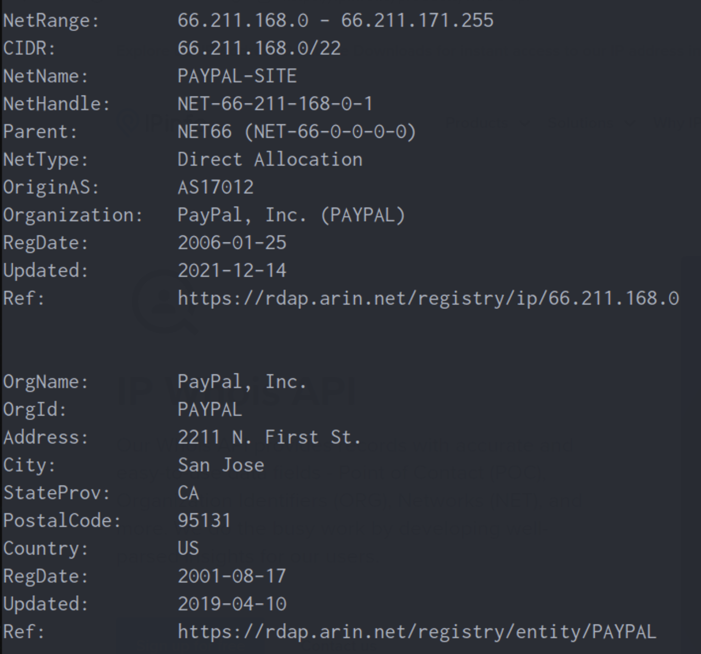

# Mail 1 analysis report

This mail is sent by paypal, the IP and reply-to address correspond to that.
There is no attachments and no suspicious links. 

**This is not a spam.** ✅

## Email header information
- Sender name: Service Paypal
- Sender email address: `Mail From: service@paypal.be`
- Reply-to email address: `service@paypal.be`
- Sender IP address: `66.211.170.87`
- Reverse lookup of the sender IP address: 

- Recipient email address: `becode@phishing-me.be` 
- Email subject line: `Reçu pour votre paiement à Spotify AB`
- Date/time: `Mon, 20 Mar 2023 08:57:04 -0700` 

## Email body information
- Any URL links (if an URL shortener service was used, then we'll need to obtain the real URL link)

With extracturl, we extract all the links from this email.
These all are legit/expected URLs.
```text
hxxp[://]www[.]linkedin[.]com/company/1482?=
hxxps[://]t[.]paypal[.]com/ts?v=3D1&amp;utm_source=
hxxps[://]twitter[.]com/PayPal?v=3D1%2C0[.]1=
hxxps[://]www[.]facebook[.]com/PayPalUSA?v=
hxxps[://]www[.]instagram[.]com/paypal/?v=
hxxps[://]www[.]paypal[.]com/be/smarthelp/article/why-am=
hxxps[://]www[.]paypal[.]com/be/webapp=
hxxps[://]www[.]paypal[.]com/be/webapps/mpp/mobile=
hxxps[://]www[.]paypal[.]com/be/webapps/mpp/paypal-buyer-protection?v=3D1&amp=
hxxps[://]www[.]paypal[.]com/cgp/app-redirect?intent=3Dx=
hxxps[://]www[.]paypal[.]com/cgp/app-redirect?intent=3Dxo_email_txn_details&a=
hxxps[://]www[.]paypal[.]com/selfhelp/h=
hxxps[://]www[.]paypal[.]com/us/webapps/mpp/security/suspicious-act=
hxxps[://]www[.]paypalobjects[.]com/digitalasset=
hxxps[://]www[.]paypalobjects[.]com/digitalassets/c/system-trig=
hxxps[://]www[.]paypalobjects[.]com/digitalassets/c/system-trigger=
hxxps[://]www[.]paypalobjects[.]com/digitalassets/c/system-triggere=
hxxps[://]www[.]paypalobjects[.]com/digitalassets/c/system-triggered-email/n/=
hxxps[://]www[.]paypalobjects[.]com/digitalassets/c/system-triggered=
hxxps[://]www[.]paypalobjects[.]com/digitalassets/c/system=
```

There is no attachment to this message.

This is not phishing. ✅


